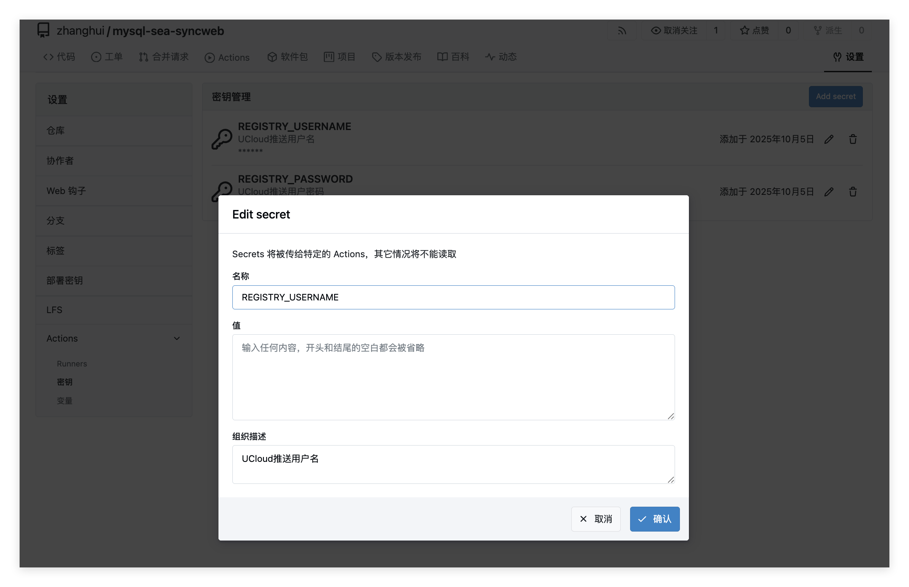

## 如何配置一次推送到多个仓库

首先在局域网gitea和公网github上都创建好仓库

先添加Gitea作为第二个push地址，push时先推Gitea（内网快），再推GitHub（外网慢）

```bash
git remote set-url --add --push origin http://192.168.1.10:3000/zhanghui/mysql-sea-syncweb.git
git remote set-url --add --push origin https://github.com/freecow/mysql-sea-syncweb.git
```

添加GitHub作为第一个push地址

```bash
git remote set-url --add --push origin https://github.com/freecow/mysql-sea-syncweb.git
```

验证配置

```bash
git remote -v

# 应该看到
origin  https://github.com/freecow/mysql-sea-syncweb.git (fetch)
origin  http://192.168.1.10:3000/你的用户名/mysql-sea-syncweb.git (push)
origin  https://github.com/freecow/mysql-sea-syncweb.git (push)
```

测试推送

```bash
# 推送当前分支（会同时推送到GitHub和Gitea）
git push origin dev

# 推送所有分支
git push origin --all

# 推送标签
git push origin --tags
```


## 如何保留两个远程仓库

参看当前远程仓库

```bash
git remote -v
```

添加Gitea远程仓库

```bash
git remote add gitea http://192.168.1.10:3000/你的用户名/mysql-sea-syncweb.git

# 现在有两个远程仓库：
# origin -> GitHub
# gitea -> Gitea
```

测试推送

```bash
# 推送到GitHub
git push origin main

# 推送到Gitea
git push gitea main

# 或同时推送到两个仓库
git push origin main && git push gitea main
```


## 如何编写workflow

在.github或.gitea目录中workflows下分别创建docker-build.yml

```bash
# 工作流目录独立
- GitHub: .github/workflows/
- Gitea: .gitea/workflows/
- 两者互不干扰

# Git支持多个远程仓库
- 可以同时推送到多个remote
```

在Gitea仓库中配置以下Secrets，路径为仓库名 → 设置 → Actions → 密钥，即REGISTRY_USERNAME和REGISTRY_PASSWORD



下面是.gitea/workflow/docker-build.yml

```yaml
# 工作流名称
name: Build And Push Images

# 触发条件
on:
  # 任意分支，main及dev等都触发
  push: {}
  # 手动触发
  workflow_dispatch: {}

jobs:
  build-and-push: # 定义Job
    name: Build ${{ matrix.component }} for ${{ matrix.arch }}
    # 运行器
    runs-on: ubuntu-latest
    env: # 全局变量
      DOCKER_BUILDKIT: "1"
      # UCloud仓库地址
      REGISTRY: uhub.service.ucloud.cn
      # UCloud命名空间
      NAMESPACE: igalaxycn
    strategy:
      # 一个失败不影响其它矩阵项继续跑
      fail-fast: false
      matrix: # 交叉矩阵
        arch: [ amd64, arm64 ] # 两个架构
        component: [ backend, frontend ] # 两个组件
    steps:
      - name: Checkout # 拉取代码
        uses: actions/checkout@v4
      
      # 设置镜像tags，标签格式为<arch>-<YYYYMMDD>-<shortsha>，避免同日重复
      - name: Set tags (date + short sha) 
        id: date
        run: |
          # 当天日期
          echo "DATE_TAG=$(date +%Y%m%d)" >> $GITHUB_ENV
          # 当前提交的 7 位短 SHA
          echo "SHORT_SHA=$(git rev-parse --short=7 HEAD)" >> $GITHUB_ENV

      # 安装binfmt，允许在x86 Runner上构建arm64等跨架构镜像（需要特权）
      - name: Enable binfmt for cross-arch
        run: |
          docker run --privileged --rm tonistiigi/binfmt --install all

      # 登录 UCloud 镜像仓库
      - name: Docker login (UCloud)
        run: |
          # 为兼容历史变量名，依次尝试UCLOUD_USERNAME -> DOCKER_USERNAME -> REGISTRY_USERNAME
          USERNAME="${{ secrets.UCLOUD_USERNAME }}"
          [ -z "$USERNAME" ] && USERNAME="${{ secrets.DOCKER_USERNAME }}"
          [ -z "$USERNAME" ] && USERNAME="${{ secrets.REGISTRY_USERNAME }}"

          PASSWORD="${{ secrets.UCLOUD_PASSWORD }}"
          [ -z "$PASSWORD" ] && PASSWORD="${{ secrets.DOCKER_PASSWORD }}"
          [ -z "$PASSWORD" ] && PASSWORD="${{ secrets.REGISTRY_PASSWORD }}"

          if [ -z "$USERNAME" ] || [ -z "$PASSWORD" ]; then
            echo "username/password not provided. Please set one of the following secrets:" >&2
            echo "  - UCLOUD_USERNAME / UCLOUD_PASSWORD (preferred)" >&2
            echo "  - DOCKER_USERNAME / DOCKER_PASSWORD" >&2
            echo "  - REGISTRY_USERNAME / REGISTRY_PASSWORD" >&2
            exit 1
          fi

          echo "Using registry: $REGISTRY"
          echo "$PASSWORD" | docker login "$REGISTRY" --username "$USERNAME" --password-stdin

      # 确定镜像构建Dockerfile
      - name: Select Dockerfile and image name
        id: select
        run: |
          # 根据矩阵中的 component 选择 Dockerfile 与镜像名，写入 GITHUB_ENV
          if [ "${{ matrix.component }}" = "backend" ]; then
            echo "DOCKERFILE=Dockerfile.backend" >> $GITHUB_ENV
            echo "IMAGE_NAME=mysql-sea-syncweb-backend" >> $GITHUB_ENV
          else
            echo "DOCKERFILE=Dockerfile.frontend" >> $GITHUB_ENV
            echo "IMAGE_NAME=mysql-sea-syncweb-frontend" >> $GITHUB_ENV
          fi

      # 构建镜像
      - name: Build image
        run: |
          # 打包标签
          FULL_IMAGE="$REGISTRY/$NAMESPACE/$IMAGE_NAME:${{ matrix.arch }}-$DATE_TAG-$SHORT_SHA"
          echo "Building $FULL_IMAGE with $DOCKERFILE"
          # 构建指定架构镜像，backend与frontend的amd64/arm64四个镜像
          docker build \
            --platform linux/${{ matrix.arch }} \
            -f "$DOCKERFILE" \
            -t "$FULL_IMAGE" \
            .

      # 推送镜像
      - name: Push image
        run: |
          FULL_IMAGE="$REGISTRY/$NAMESPACE/$IMAGE_NAME:${{ matrix.arch }}-$DATE_TAG-$SHORT_SHA"
          echo "Pushing $FULL_IMAGE with retry..."
          # 最多5次重试
          max=5
          n=1
          until [ $n -gt $max ]
          do
            # 推送镜像
            if docker push "$FULL_IMAGE"; then
              echo "Push succeeded"
              break
            fi
            rc=$?
            # 失败后15s、30s、45s、60s、75s回退重试
            wait=$(( n * 15 ))
            echo "Push failed (rc=$rc). Retry $n/$max after ${wait}s..."
            # 每次重试前会尝试重新登录，以缓解偶发 50x/鉴权问题
            if [ $n -lt $max ]; then
              USERNAME="${{ secrets.UCLOUD_USERNAME }}"; [ -z "$USERNAME" ] && USERNAME="${{ secrets.DOCKER_USERNAME }}"; [ -z "$USERNAME" ] && USERNAME="${{ secrets.REGISTRY_USERNAME }}";
              PASSWORD="${{ secrets.UCLOUD_PASSWORD }}"; [ -z "$PASSWORD" ] && PASSWORD="${{ secrets.DOCKER_PASSWORD }}"; [ -z "$PASSWORD" ] && PASSWORD="${{ secrets.REGISTRY_PASSWORD }}";
              if [ -n "$USERNAME" ] && [ -n "$PASSWORD" ]; then
                echo "$PASSWORD" | docker login "$REGISTRY" --username "$USERNAME" --password-stdin || true
              fi
              sleep $wait
            fi
            n=$(( n + 1 ))
          done
          if [ $n -gt $max ]; then
            echo "Push failed after $max attempts" >&2
            exit 1
          fi

```

